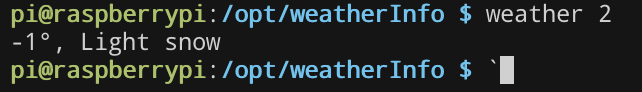

#### View the weather in your terminal

  
<p align="center">
  
</p>
<sup>Uses [OpenWeatherMap](http://openweathermap.org) as data source.</sup>

#### Installation

```
pip install -Ur requirements.txt
ln -s `pwd`/weather.py /usr/local/bin/weather  # Optional symlink for convenience
```
This is a modified version of:
https://github.com/dideler/simple-weather
